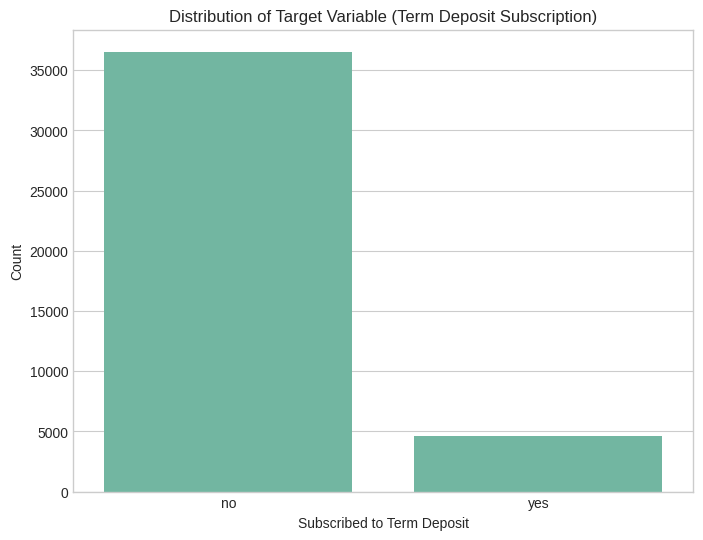
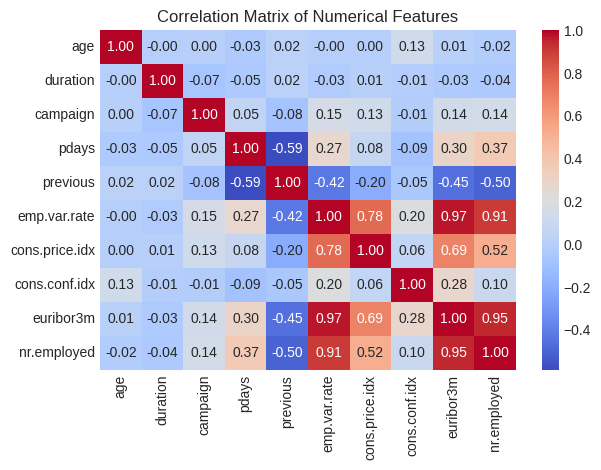
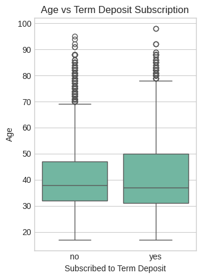
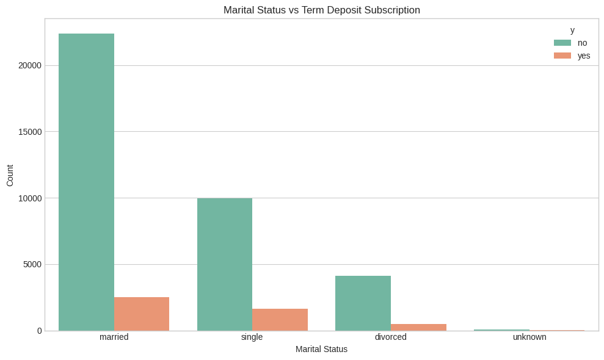
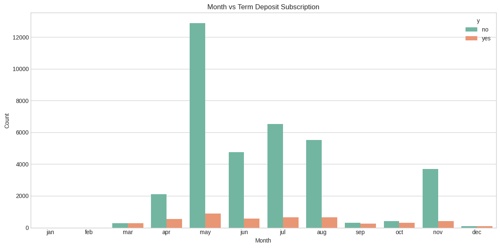
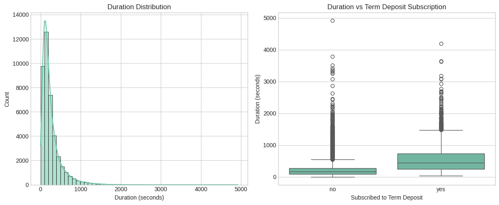
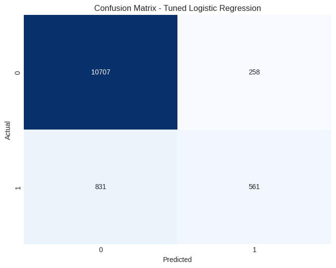
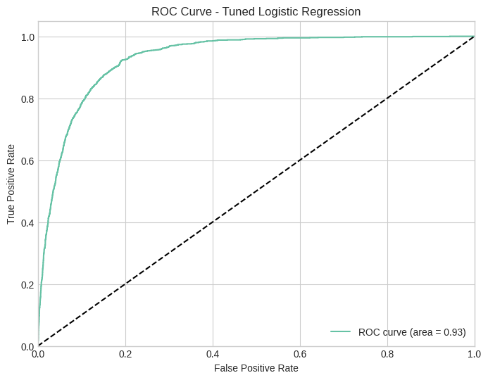

# 🏦 Predicting Bank Marketing Campaign Outcomes

**Using Machine Learning to identify which customers are most likely to subscribe to a term deposit — turning raw campaign data into smarter, more efficient marketing decisions.**


---

## 📌 Overview

Marketing teams don't have unlimited budget to call every customer — every wasted call costs time and money. This project builds a **binary classification pipeline** that predicts whether a bank customer will subscribe to a term deposit, based on their demographic profile, campaign contact history, and prevailing economic conditions.

The end goal is directly applicable to **marketing automation**: instead of blanket outreach, campaigns can be prioritized toward the customers a model flags as high-propensity — improving conversion rates while cutting acquisition cost.

## 🏆 Key Achievements

- ✅ Benchmarked **5 machine learning models** (KNN, Decision Tree, Logistic Regression, Naive Bayes, Neural Network) on **41,188 customer records**
- ✅ Best model (**Logistic Regression**) achieved **91.1% accuracy** and a **0.93 ROC-AUC score**
- ✅ Engineered a full preprocessing pipeline handling missing data, mixed categorical encodings, and feature scaling across 20 raw input features
- ✅ Surfaced actionable marketing signals — best contact months, high-conversion demographics, and the strongest predictor of a successful call
- ✅ Addressed real-world class imbalance (only 11.3% positive class) using stratified sampling and resampling-aware evaluation (precision/recall/F1, not just accuracy)

## 💡 Why This Matters for Marketing Decision-Making

| Business Question | How the Model Helps |
|---|---|
| Who should we call first? | Ranks customers by likelihood to subscribe, enabling targeted outreach |
| When should we run campaigns? | Identifies seasonal patterns (e.g. May, July, August show higher conversion) |
| How do economic conditions affect response? | Quantifies the impact of interest rates (Euribor) on subscription likelihood |
| Which past customers to re-engage? | Shows previous campaign outcome is a strong predictor of future success |
| How do we measure a "good" call? | Call duration is the single strongest behavioral signal of conversion |

---

## 📖 Table of Contents

1. [Dataset Overview](#-dataset-overview)
2. [Exploratory Data Analysis](#-exploratory-data-analysis)
3. [Data Preprocessing](#-data-preprocessing)
4. [Modeling & Results](#-modeling--results)
5. [Business Insights for Marketing](#-business-insights-for-marketing)
6. [Tech Stack](#-tech-stack)
7. [Repository Structure](#-repository-structure)
8. [How to Run](#-how-to-run)
9. [Future Improvements](#-future-improvements)
10. [Author](#-author)

---

## 📊 Dataset Overview

The dataset comes from a Portuguese bank's direct marketing campaigns (phone calls), a well-known benchmark for marketing response modeling.

| Attribute | Detail |
|---|---|
| Records | 41,188 |
| Input Features | 20 |
| Target | `y` — subscribed to term deposit (yes/no) |
| Problem Type | Binary Classification |
| Class Balance | 88.7% No / 11.3% Yes (imbalanced) |

**Feature groups:**
- **Categorical:** job, marital, education, default, housing, loan, contact, month, day_of_week, poutcome
- **Numerical:** age, duration, campaign, pdays, previous, emp.var.rate, cons.price.idx, cons.conf.idx, euribor3m, nr.employed

---

## 🔍 Exploratory Data Analysis

### Class Distribution — The Imbalance Problem
Only **11.3%** of customers in the dataset subscribed, so the modeling strategy had to account for this imbalance rather than optimizing for raw accuracy alone.



### Feature Correlation
Call `duration` is the strongest positive correlate of subscription (0.45), while economic indicators (`euribor3m`, `nr.employed`, `emp.var.rate`) are tightly correlated with each other and negatively linked to conversion.



### Age vs. Subscription
Subscribers skew slightly younger — median age ~39 vs. ~41 for non-subscribers, with the strongest response in the 25–40 age range.



### Marital Status vs. Subscription
Married customers make up the largest share of subscribers overall.



### Campaign Timing
May sees the highest contact volume, but **July, August, and December show stronger relative subscription rates** — a direct input for campaign scheduling.



### Call Duration — The Strongest Signal
Successful (subscribing) calls run noticeably longer. Calls under ~300 seconds rarely convert — useful as a live call-quality signal for agents.



---

## 🧹 Data Preprocessing

| Challenge | Solution Applied |
|---|---|
| **Missing / "unknown" values** (job, marital, education, default, housing, loan) | Separate "unknown" category for low-cardinality gaps; most-frequent/mean imputation for high-missing features |
| **Categorical encoding** | One-hot encoding (job, contact, poutcome) · Label encoding (binary yes/no fields) · Ordinal encoding (education, month) |
| **Feature scaling** | `StandardScaler` applied to all numerical features (mean=0, std=1) — critical for distance-based models like KNN and Neural Networks |
| **Class imbalance** | Stratified 70/30 train-test split to preserve class ratio in both sets |

---

## 🤖 Modeling & Results

Five classification algorithms were trained and evaluated on a held-out 30% test set (12,357 records), using accuracy, precision, recall, and F1-score — with special attention to the minority ("subscribed") class.

| Model | Accuracy | Precision (Yes) | Recall (Yes) | F1 (Yes) |
|---|---|---|---|---|
| **Logistic Regression** ⭐ | **91.1%** | 0.670 | 0.415 | 0.512 |
| Neural Network | 90.8% | 0.606 | 0.523 | **0.562** |
| KNN | 90.3% | 0.603 | 0.410 | 0.488 |
| Decision Tree | 88.7% | 0.497 | 0.515 | 0.506 |
| Naive Bayes | 87.5% | 0.456 | **0.568** | 0.506 |

**Logistic Regression** delivered the best overall accuracy and AUC, while the **Neural Network** gave the most balanced minority-class performance, and **Naive Bayes** achieved the highest recall — valuable if the priority is catching as many potential subscribers as possible, even at the cost of some false positives.

### Confusion Matrix — Tuned Logistic Regression


### ROC Curve — Tuned Logistic Regression (AUC = 0.93)


---

## 📈 Business Insights for Marketing

- **Call duration is the #1 behavioral predictor** — longer, higher-quality conversations convert more. This can inform agent training and call scripts.
- **Timing matters:** May, July, August, and December are higher-converting months — a clear signal for campaign scheduling.
- **Prior contact history is powerful:** customers with a successful previous campaign outcome are significantly more likely to convert again — prioritize re-engagement lists.
- **Macro-economic context shifts response rates:** lower Euribor rates correlate with higher subscription likelihood, useful for timing campaigns around interest-rate cycles.
- **Demographics provide moderate lift:** married customers and the 25–40 age group respond better, useful for audience segmentation — but behavioral and contact-history data outperform demographics alone.

---

## 🛠 Tech Stack

- **Language:** Python 3
- **Data Handling:** pandas, NumPy
- **Visualization:** matplotlib, seaborn
- **Modeling:** scikit-learn (KNN, Decision Tree, Logistic Regression, Naive Bayes, MLPClassifier)
- **Environment:** Jupyter / Google Colab

---

## 📁 Repository Structure

```
├── notebook/
│   └── bank_marketing_prediction.ipynb   # Full analysis, preprocessing & modeling pipeline
├── report/
│   └── Bank_Marketing_Project_Report.pdf # Detailed written report
├── images/
│   └── *.png                             # EDA & model evaluation visuals
└── README.md
```

## ▶️ How to Run

```bash
# Clone the repository
git clone https://github.com/<your-username>/bank-marketing-prediction.git
cd bank-marketing-prediction

# Install dependencies
pip install pandas numpy matplotlib seaborn scikit-learn

# Launch the notebook
jupyter notebook notebook/bank_marketing_prediction.ipynb
```

## 🚀 Future Improvements

- Apply SMOTE/undersampling more rigorously to further boost minority-class recall
- Hyperparameter tuning via GridSearchCV/RandomizedSearchCV across all models, not just the top performer
- Feature importance analysis (SHAP) for full model explainability
- Deploy the best model as a simple scoring API for real-time lead prioritization

---

## 👤 Author

**[Your Name]**
Course project — Machine Learning / Predictive Analytics
📧 [your.email@example.com] · 🔗 [LinkedIn](https://linkedin.com/in/yourprofile)

---

*If you found this project useful, consider giving it a ⭐!*
